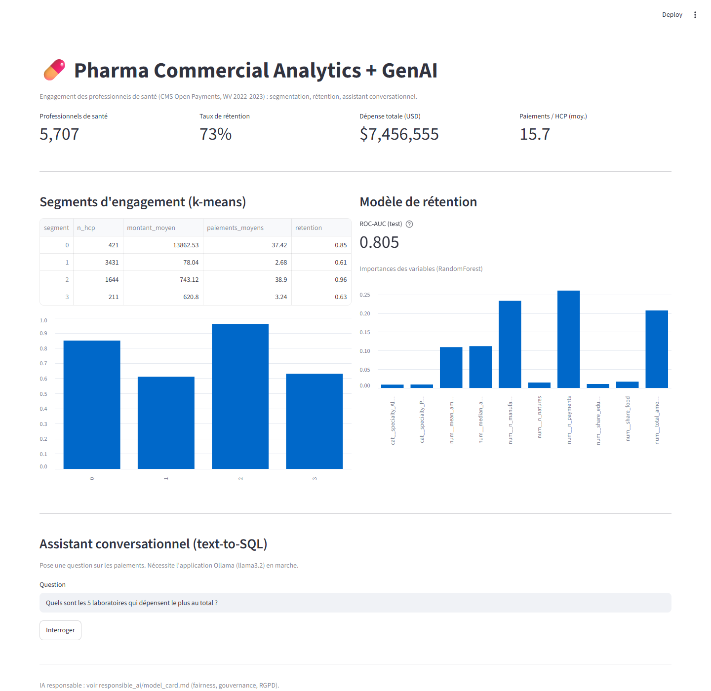

# 💊 Analytics commercial pharmaceutique + GenAI

[](https://www.python.org/)
[](https://scikit-learn.org/)
[](https://www.langchain.com/)
[](https://streamlit.io/)
[](LICENSE)

Data science commerciale de bout en bout sur des données marketing pharmaceutiques réelles (CMS Open Payments) : modèle de rétention des professionnels de santé avec SHAP, segmentation de l'engagement, assistant GenAI text-to-SQL, tableau de bord interactif et model card d'IA responsable.

---

## Objectif

Les laboratoires pharmaceutiques investissent massivement dans l'engagement des professionnels de santé (PS). Les équipes commerciales ont besoin de comprendre et de segmenter cet engagement, de prédire quels PS restent engagés d'une année à l'autre, de laisser des interlocuteurs non techniques explorer les données en langage clair, et de faire tout cela sous contrainte d'IA responsable.

Ce projet construit un système compact de bout en bout sur données publiques, qui reflète les missions d'un poste de Data Science commerciale en pharma : nettoyage et structuration, modélisation prédictive et évaluation, GenAI et analytique conversationnelle, data storytelling et gouvernance de l'IA.

---

## Jeu de données

- **Source** : CMS Open Payments (États-Unis), public. General Payments.
- **Périmètre** : Virginie-Occidentale, année de programme 2022 (variables) à 2023 (cible de rétention).
- **Taille** : 5 707 PS ; 185 027 paiements après dédoublonnage (186 426 paiements bruts sur les deux années).
- **Taux de base** : 73,3 % de rétention.
- **Accès** : récupéré automatiquement depuis l'API de données CMS par `src/01_prepare_data.py` (aucun téléchargement manuel). Les données brutes et la base SQLite ne sont pas versionnées (voir `.gitignore`).
- **Limite qualité identifiée et corrigée** : les noms de laboratoires présentaient plusieurs graphies (« ABBVIE INC. » vs « AbbVie Inc. »), ce qui aurait biaisé le comptage de laboratoires partenaires. Normalisés (`.str.upper().str.strip()`) avant agrégation ; 1 204 lignes strictement dupliquées (0,65 %) supprimées.

---

## Structure du projet

```
pharma-commercial-genai/
│
├── data/
│   └── README.md                   # source des données et notes de récupération (données brutes non versionnées)
├── notebooks/                      # analyse interactive (à ouvrir, exécuter et modifier dans Jupyter/VS Code)
│   ├── 01_exploration.ipynb        # EDA : chargement des données brutes, observation, décisions de préparation
│   ├── 02_preparation.ipynb        # application des décisions : nettoyage, agrégation, cible de rétention
│   ├── 03_modeling.ipynb           # modèle de rétention, SHAP, segmentation, fairness
│   └── 04_genai_assistant.ipynb    # assistant text-to-SQL
├── src/
│   ├── 01_prepare_data.py          # récupération API CMS, nettoyage, audit qualité, construction SQLite
│   ├── 02_modeling.py              # modèle de rétention, SHAP, segmentation, contrôle de fairness
│   ├── 03_genai_assistant.py       # assistant text-to-SQL sur une vue sémantique
│   └── dashboard.py                # Streamlit : KPIs, segments, modèle, assistant
├── responsible_ai/
│   └── model_card.md               # métriques, fairness, éthique, gouvernance, RGPD
├── requirements.txt
├── .gitignore
└── README.md
```

---

## Reproduire

### 1. Cloner

```bash
git clone https://github.com/juliettebm/pharma-commercial-genai.git
cd pharma-commercial-genai
```

### 2. Installer

```bash
python -m venv .venv
.venv\Scripts\activate            # Linux/macOS : source .venv/bin/activate
pip install -r requirements.txt
```

### 3. Construire le jeu de données (API CMS)

```bash
python src/01_prepare_data.py       # télécharge une tranche d'un État et construit data/openpayments.sqlite
```

### 4. Modèle, assistant, tableau de bord

```bash
python src/02_modeling.py                       # modèle de rétention + SHAP + segmentation + fairness
python src/03_genai_assistant.py "Combien de professionnels de sante en 2023 ?"
streamlit run src/dashboard.py                  # tableau de bord interactif
```

L'assistant GenAI a besoin d'un LLM local. Installez Ollama, lancez `ollama pull llama3.2` et gardez l'application en marche (ou définissez `LLM_PROVIDER=openai` avec une clé API).

Les mêmes étapes sont disponibles sous forme de notebooks interactifs dans [`notebooks/`](notebooks/) (01 à 03), à ouvrir, exécuter et modifier dans Jupyter ou VS Code.

---

## Méthodologie

1. **Préparation des données** : récupération paginée depuis l'API de données CMS pour un État et deux années, nettoyage, audit qualité, agrégation en un profil d'engagement par PS, et base de données relationnelle SQLite.
2. **Modèle de rétention** : Random Forest prédisant si un PS engagé en année N l'est encore en année N+1. La séparation temporelle des variables et de la cible évite les fuites.
3. **Explicabilité** : valeurs SHAP en complément des importances de variables.
4. **Segmentation** : k-means sur les profils d'engagement.
5. **Assistant GenAI** : une question en langage naturel est traduite en SQL sur une vue sémantique aux noms de colonnes courts, exécutée, puis reformulée. Les garde-fous n'autorisent que le SELECT.
6. **IA responsable** : fairness découpée par spécialité, plus une model card couvrant la gouvernance et le RGPD.

---

## Résultats clés

Périmètre : Virginie-Occidentale, 2022 à 2023, 5 707 PS, 73,3 % de rétention.

| Métrique | Valeur |
| --- | --- |
| ROC-AUC (Random Forest) | **0,805** |
| ROC-AUC (baseline majoritaire) | 0,500 |
| PR-AUC | 0,920 |

Principaux facteurs (importances de variables et SHAP concordent) : nombre de paiements, nombre de laboratoires, montant total. La rétention est portée par l'intensité de l'engagement, pas par la spécialité.

**Segments d'engagement (k-means, sur variables standardisées avec log1p sur les montants et comptes) :**

| Segment | PS | Montant moyen | Paiements moyens | Laboratoires moyens | Rétention |
| --- | ---: | ---: | ---: | ---: | ---: |
| Cœur fidèle | 1 630 | 756 $ | 39 | 9,8 | **96 %** |
| Haute valeur | 181 | 27 597 $ | 60 | 6,8 | 87 % |
| Valeur ponctuelle | 512 | 1 892 $ | 11 | 2,9 | 73 % |
| Engagement minimal | 3 384 | 77 $ | 2,7 | 1,7 | **62 %** |

**Fairness (AUC par spécialité) :** solide pour les grands groupes (médecins 0,807, PA/APN 0,804) mais nettement plus faible pour les Dental Providers (**0,639**), donc les prédictions ne sont pas appliquées uniformément.

---

## Dashboard

Un tableau de bord Streamlit restitue les résultats aux équipes commerciales : KPIs, segments d'engagement, performance et importances du modèle, et l'assistant conversationnel, le tout dans une interface unique sans code.



```bash
streamlit run src/dashboard.py
```

---

## IA responsable

Profiler les PS selon leur valeur commerciale est sensible, le projet le traite donc explicitement : transparence SHAP, un découpage de fairness qui a révélé l'écart des Dental Providers, des limites et des contrôles de fuite documentés, et une note de gouvernance des données / RGPD. Synthèse dans [`responsible_ai/model_card.md`](responsible_ai/model_card.md).

---

## Avertissement

Preuve de concept pédagogique sur données publiques concernant des individus réels (médecins). Utilisée à des fins d'analyse et de démonstration uniquement, pas pour des décisions de ciblage individuel.

---

## Stack

Python 3.11 · pandas · scikit-learn · SHAP · SQLite · LangChain · Streamlit · Ollama / OpenAI

---

## Licence

Publié sous [licence MIT](LICENSE).

---

## Autrice

**Juliette Bouli-Mengue**
De la recherche clinique à la data science
